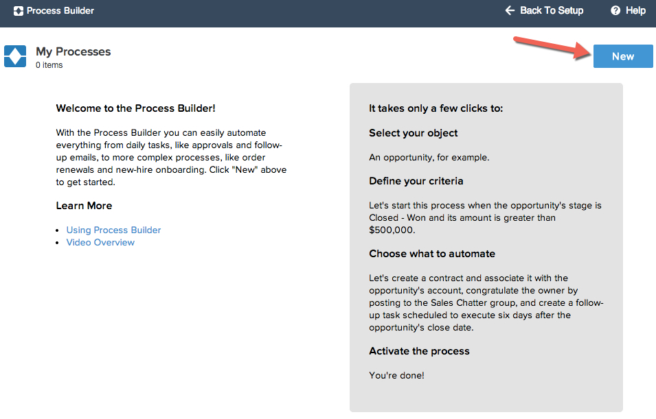
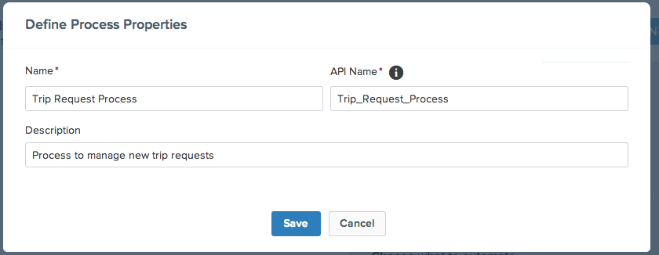

We are going to begin building a process to manage trip approvals in this org. We have a number of business  requirements we would like to implement in this process. All trips under $3000 are considered a small trip and should go through a specific process tied to that. 

## Process Goals
- Trip request should be routed for approval
- Trip details should be shared within the employee travel community to foster collaboration
- Calendar of trip creator should be updated automatically
- Available for mobile employees

## What you will learn
- Create a new Lightning Process. 

##Create Process: 

1. In the setup navigation bar to the left of your setup screen, navigate to **Build|Workflow&Approvals|Process Builder**

2. Click on **Process Builder** and you will see the splash screen welcoming you to the Process Builder. Select **New** to begin building a new process.  
  
    

3. Fill our your process details 
- Name: **Trip Request Process**
- API Name: **Trip_Request_Process_
- Description: **Process to manage new trip requests**
- Click **Save**
  

You have just created a new Lightning Process! Now we need to define where and when this process should run. 

<a href="setup-environment.html" class="btn btn-default"><i class="glyphicon glyphicon-chevron-left"></i> Previous</a>
<a href="create-lightning-application.html" class="btn btn-default pull-right">Next <i class="glyphicon glyphicon-chevron-right"></i></a>

