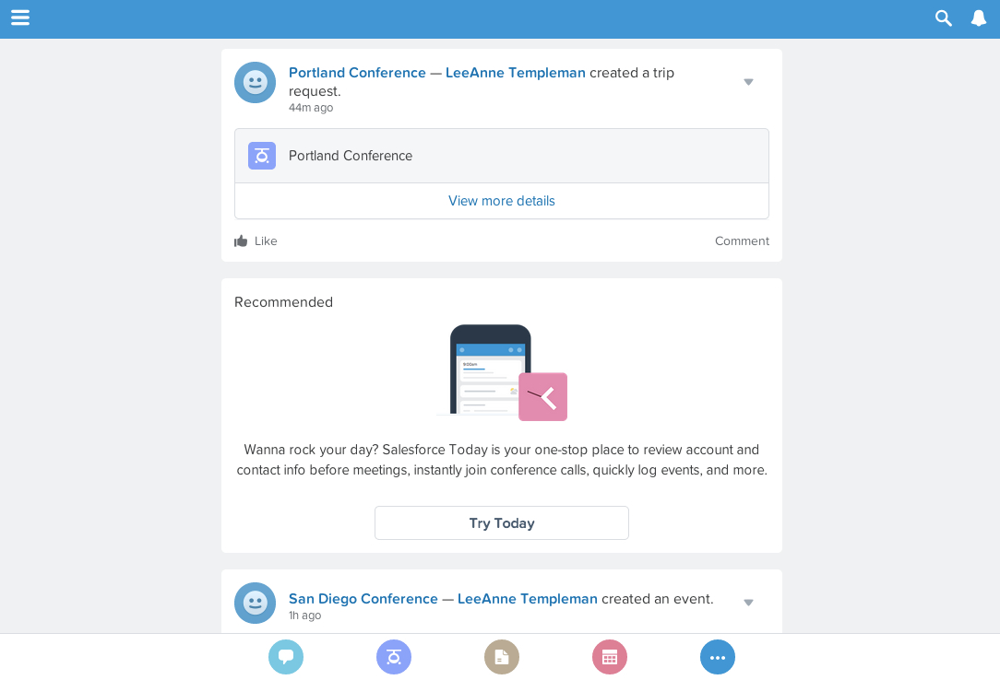
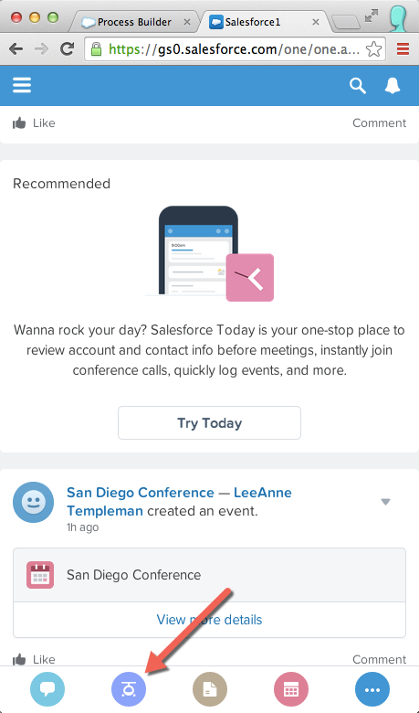
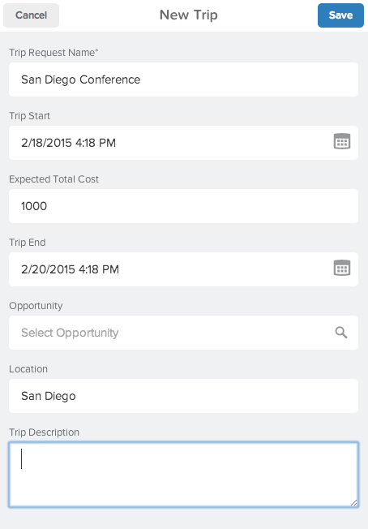
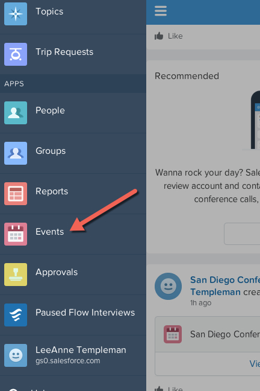

In this module, you test the new, active process in the mobile environment. This is useful when building mobile apps in salesforce production and test environments, as it allows you to see the mobile experience that your end users will have. For this example you can either use the Chrome desktop browser on your computer in a mobile view, or you can use the Salesforce1 Mobile app in your smartphone. Instructions will be provided for testing in the Chome Mobile view. 

*If you are unable to use Chrome or access the Salesforce1 Mobile app on a smartphone or mobile device, the review can be conducted entirely in the desktop view beginning on the Chatter tab with the **New Trip** Action. *

## What you will learn

- How to test salesforce development for mobile users using either the Chrome browser or the Salesforce1 Mobile App. 

## Step 1: Switch to Chrome Mobile View

1. If you are not already, login to your salesforce environment in the Chrome browser. Take a look at the URL address in the browser. 
2. Add /one/one.app to the end of your URL of the domain your Salesforce instance is on. If your Developer Edition is located on na15, meaning when you log in you URL looks something like https://na15.salesforce.com/home/home.jsp. To navigate to the Salesforce1 mobile app view, change the /home/home.jsp to /one/one.app. 

You can resize your browser window now to a smaller size, more similar to a mobile screen. 

## Step 2: Create new Trip Request
When we setup our environment, we added a custom action for new trip request to the global layout. This allows all our mobile users to have access to this action from their mobile screen. We will now use this action to create a new trip request and test our new Lightning Process. 

1. In the bottom of your mobile view, there is an action bar containing the icons for your mobile actions. Select the helicopter icon for the **New Trip** action. 

2. Create your new trip record. Let's call this trip **San Diego Conference**, and select dates within a few days of today (This will make it easier to check the calendar update action), the cost is $1000 and the location is San Diego. 

3. Select **Save**

## Step 3: Review Process Results 
Now that you have created your trip record, click around your mobile environment and test the results! 

1. Check your user chatter feed
2. Check your calendar update action by navigating to the left navigation of your mobile view and selecting **Events**

3. Check the approval status on the trip request action by navigating to the left navigation of your mobile view and selecting **Trip Requests**. From here you can view the new record you just created, and the approval details will be included in the related list of this record. 

<a href="create-searchbar-component.html" class="btn btn-default"><i class="glyphicon glyphicon-chevron-left"></i> Previous</a>
<a href="next.html" class="btn btn-default pull-right">Next <i class="glyphicon glyphicon-chevron-right"></i></a>

