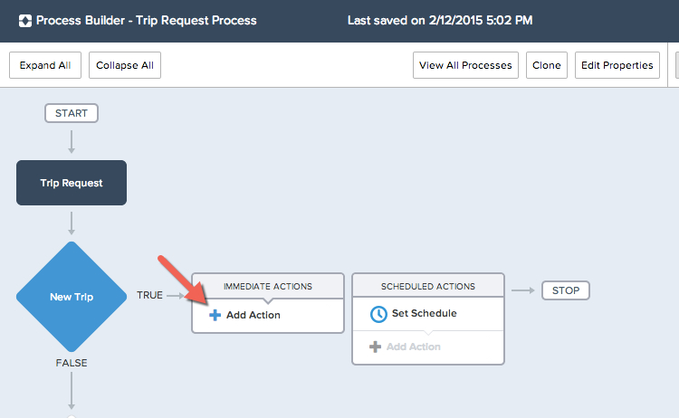
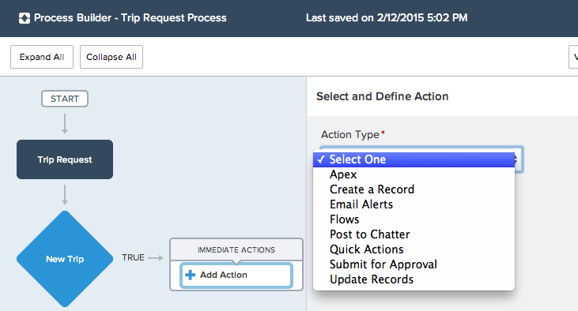
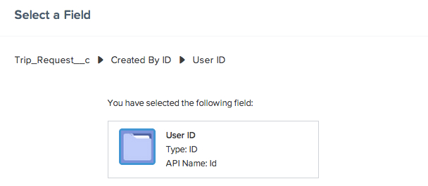
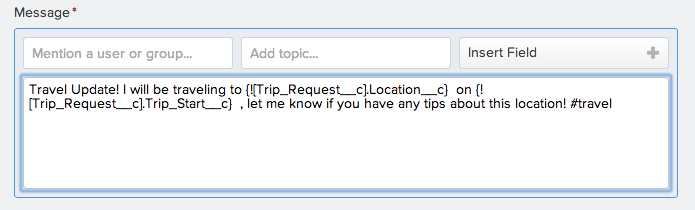
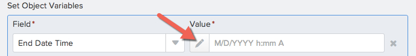
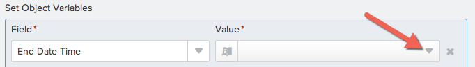
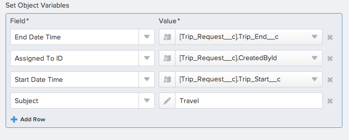
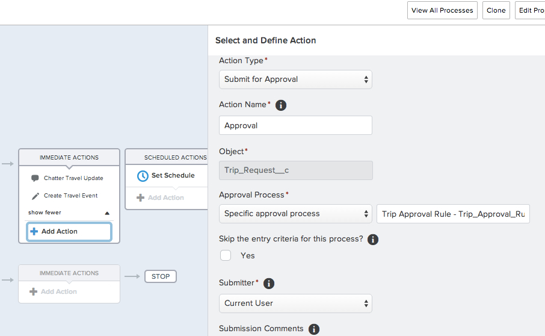

In this module, we will add actions to our the process. Using the Lightning Process Builder we have the ability to add either immediate or scheduled actions which will execute when the criteria we defined in the previous module evaluates to true. For this tutorial we will create a series of immediate actions. We will be creating 3 actions. Post to Chatter, Create a Record, and Submit for Approval. Without the Lightning Process Builder it would require code to create new related or unrelated records 

## What you will learn
- How to add immediate actions to the process builder

## Step 1: Add a Chatter Post action 
One of our business requirements is to notify the other travelers in the company about a new trip. We are going to post a notification to the travelers Chatter timeline including details about their trip, as well as a topic hashtag. You can also use Chatter post actions to 

1. In the Immediate Actions element directly to the right of the criteria you just created, Select **Add Action**

 

2. For the Action Type we will select **Post to Chatter**. 
*Notice the variety of action types you can create here.*

3. Name this action **Chatter Travel Update**
1. We want this chatter post to update to the chatter feed of the traveler on this trip, so we will select Post To: **User** , Select a user from a record, and select the record creator User ID. 

1. Now that you have defined where the chatter update will post, add text and information to the post. Use the **Insert Field** area in the message box to include merge fields from the record like Location and Trip Start. 
 

1. Click **Save**

## Step 2: Add an Record Creation Action 
Another business requirement was to automatically update the Salesforce calendar of the traveler. This calendar is populated using a standard object for Events, so we will want to create a new event record with dates and information that corresponds to the Trip Request that was created. Using the Lightning Process Builder we can create entirely new records, of custom or standard objects, related or unrelated to the primary process object. Related would mean that there were lookup fields or relationships connecting the objects, such as the Account field on the Contact object. This means those objects are related in salesforce. For this step we will be creating a new **Event** record, which is not related to the Trip Request custom object. We will create a new record as well as populate fields on that record based on information in the Trip Request record. 

1. In the same Immediate Actions node where you added the previous action, click on **Add Action**
2. Select **Create Record**
3. Name this action "Create Travel Event"
3. All custom and standard objects are available to select. Select **Event** object
4. In order to populate the fields on this new record with information from the Trip Request record, we will use the lookup features in the Process Builder. Select the **Edit** icon in the left side of the Value cell in order to switch to the lookup function.  

1.Then select the arrow on the right side of the cell to open up the lookup screen.
 
1. Assign values for the new event record based on below screenshot. For the Subject Field do not select a lookup option, instead type in "Travel" to assign this as the subject field for all records created with this action. 
 
1. Select **Save**

## Step 3: Add an Approval Action  
Our final and most important business requirement is to submit the new Trip Request for Approval. Using the Lighting Process Builder you can either trigger an existing approval process built using approvals, or you can select Default approval process and rely on the system approver fields. For this exercise we have an existing approval process built that we will select. 

1. Click on **Add Action**
2. Action Type **Submit for Approval**
1. Select the **Specific approval process** already built called **Trip Approval Rule**
 
1. **Save**

<a href="create-lightning-application.html" class="btn btn-default"><i class="glyphicon glyphicon-chevron-left"></i> Previous</a>
<a href="create-searchbar-component.html" class="btn btn-default pull-right">Next <i class="glyphicon glyphicon-chevron-right"></i></a>

