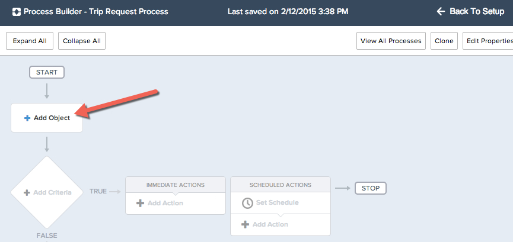
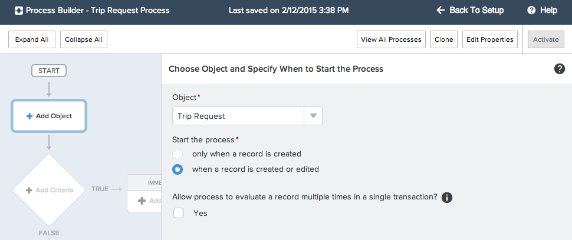
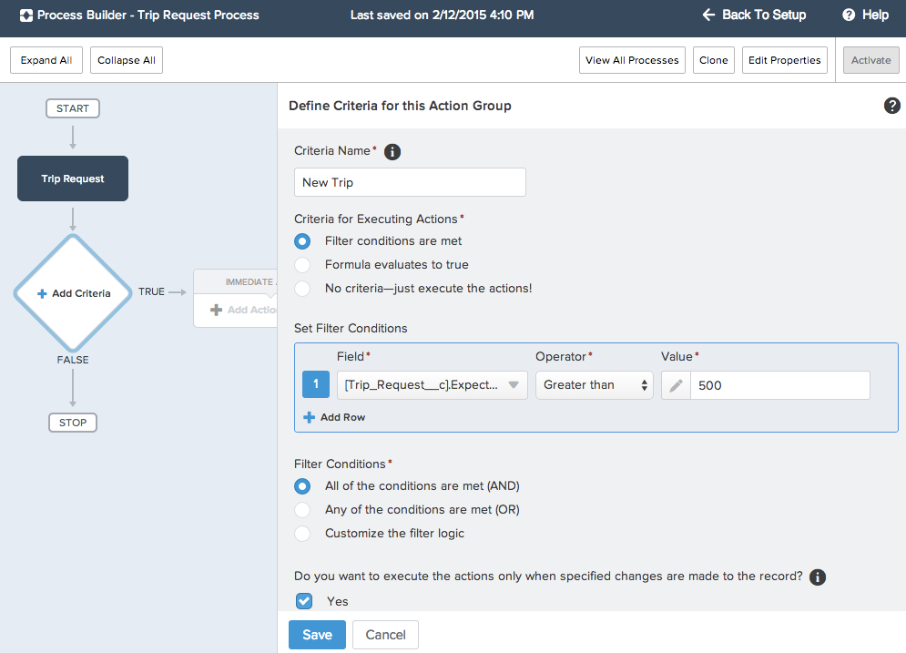

The process exists, but there is not criteria detailing when and where this process should run. We will add a target object to this process. This object will be where the process criteria will be defined, so for this example we will want to evaluate the process for the custom object we just installed called **Trip Requests**. With the power of the new Lightning Process Builder you are able to execute actions on objects related or unrelated to this original object.  We will be able to add actions later on to create or update other types of objects, but this step determines which specific object the process criteria(s) will be on. 

## What you will learn
- Define Process target object
- Define when target object should be evaluated
- Define Process criteria 

## Step 1: Define the Object

1. In your new process screen, select the **Add Object** element. 

2. All of our standard and custom objects are available to select, including the object just installed with the AppExchange package. We want to Select the **Trip Request** object. 
3. Because we want to evaluate all elligible trip requests, even ones that were edited after creation, we select the option: 
    - Start the process: **When a record is created or edited** 
4. Leave the checkbox **Unchecked** 

*Note: If you select yes, the process can evaluate the same record up to five additional times in a single transaction. It might reevaluate the record because a process, workflow rule, or flow updated the record in the same transaction.
For example, your sales review process includes multiple steps, approvals, notifications, and fields that need to be updated. Some of these changes may be part of your process, or they may be managed by other workflow rules or flows in your organization. If you allow the Process Builder to reevaluate a record multiple times in a single transaction, you can manage and evaluate all of these changes—even changes from other processes—in a single transaction in your process.* 
5. Select **Save**

## Step 2: Define the Criteria
Now that we have determined *Where* the process will evaluate, we need to define *When* this process should run. Notice you have the ability to create multiple action paths based on True/False criteria. For this tutorial we will be creating one process path with immediate actions, but using the Lightning Process Builder you can create multiple different criteria as well as subsequent immediate and scheduled actions. 

1. Select **Add Criteria** in your Process Builder Screen 
2. Define Criteria details
- Criteria Name: **New Trip** 
*This name appears on the canvas to help you distinguish the criteria and its action group from the other criteria and action groups in the process.*
- Criteria for Executing Actions: **Filter Conditions Are Met**
*You can define criteria using conditions with existing operators, formulas, or just execute the process actions without any criteria* 
- Filter Condition: Trip_Request__c.Airfare_Cost__c  is Greater than $500 
- Filter Conditions: **All of the conditions are met**
- Check the **Yes** Checkbox to execute the actions only when specified changes are made. This means the actions are executed only if the record meets the criteria now but the values that the record had immediately before it was saved didn't meet criteria. This means that these actions won't be executed when irrelevant changes are made.

3. Click **Save**

You have now defined when and where this process should run, now time to define what actions should execute!

<a href="create-apex-controller.html" class="btn btn-default"><i class="glyphicon glyphicon-chevron-left"></i> Previous</a>
<a href="create-contactlist-component.html" class="btn btn-default pull-right">Next <i class="glyphicon glyphicon-chevron-right"></i></a>

