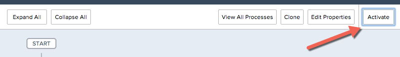
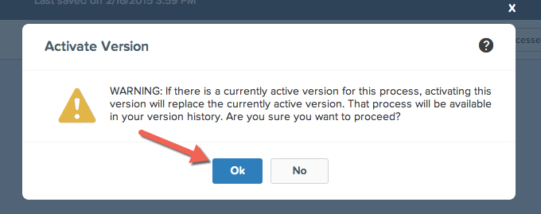

Now that we have created this process, defined the criteria, and added our immediate process actions, it needs to be activated in order to evaluate new Trip Request records. 
After you activate a process, you can no longer edit that process. However, you can click Clone to save the process as a new inactive process.
You can’t activate a process unless it has:

1. At least one defined criteria node
2. At least one defined immediate or scheduled action

##Activate The Process

1. In the upper right hand corner of your Process Builder screen, Click **Activate**.

2. You will see a warning regarding process activation, click **Ok**
*If you activate a version of a process that already has an active version, the previously active version is automatically deactivated. To see that version later, refer to the process’s version history.*

If you later want Salesforce to stop using a process to evaluate records as they’re created or edited, open the active process and click Deactivate.

Your process is now active! Time to test it out. 

<a href="create-contactlist-component.html" class="btn btn-default"><i class="glyphicon glyphicon-chevron-left"></i> Previous</a>
<a href="create-contactdetails-component.html" class="btn btn-default pull-right">Next <i class="glyphicon glyphicon-chevron-right"></i></a>

