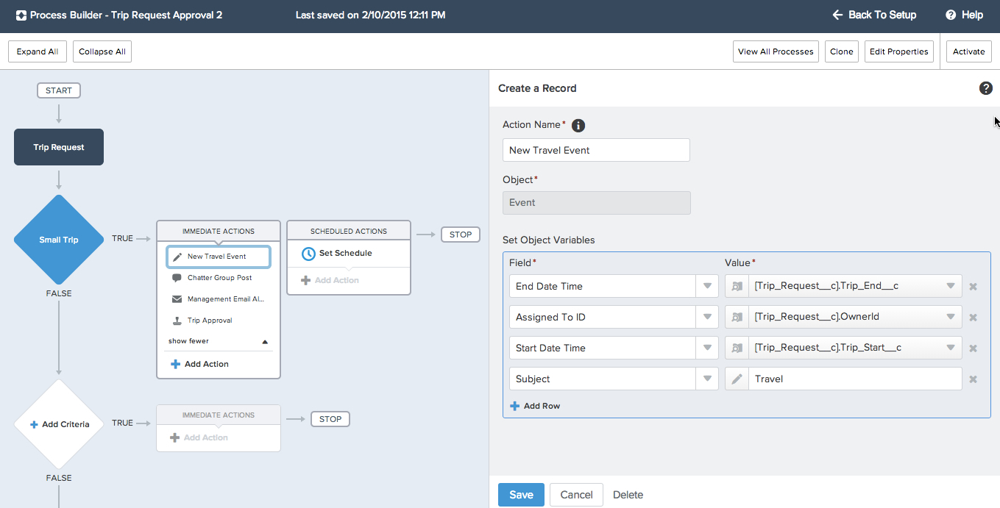

The Salesforce1 Lightning Process Builder is a new workflow tool that helps anyone in your company quickly and easily automate business processes such as employee onboarding, and new customer onboarding - all without writing a single line of code. Creating new processes through a point and click interface helps you avoid repetitive time-consuming tasks so you can do more and go faster.

In this tutorial, you use the Lightning Process Builder to build process used to manage a trip approval business process. The process automates multiple notifications and calendar updates triggered by a trip request.
The process uses an installed custom object with related action to automate a business process.

## What You Will Learn

- Install a private AppExchange package 
- Create a custom lightning process
- Automate a chatter post
- Use the process builder to create and update an unrelated record
- Activate a lightning process
- Test the lightning process in a mobile environment

## Browser Requirements

The following browsers are supported when working with Salesforce:

  - Most recent version of Google Chrome
  - Most recent version of Mozilla Firefox
  - Most recent version of Safari
  - Internet Explorer 7 or higher
  - Additional browser support detailed <a href="https://help.salesforce.com/apex/HTViewHelpDoc?id=getstart_browser_overview.htm" target="_blank">here</a>

## Issues

- Please create an issue [here](https://github.com/leeanndroid/LightningProcessBuilder/issues) if you run
into any problem or if you have a suggestion to improve this workshop.
- You can also use the Comments section at the bottom of each module to ask a question or report a problem.

<a href="create-developer-edition.html" class="btn btn-default pull-right">Next <i class="glyphicon glyphicon-chevron-right"></i></a>

