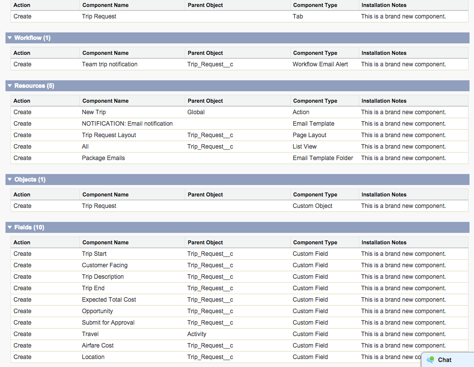
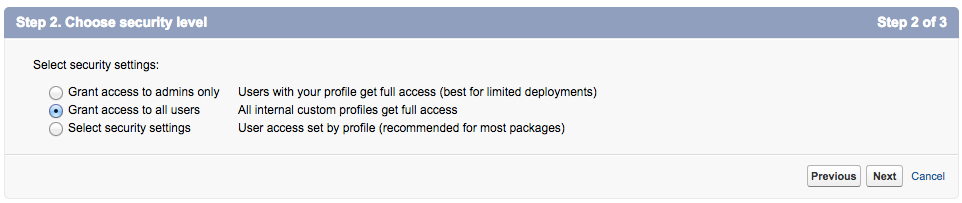
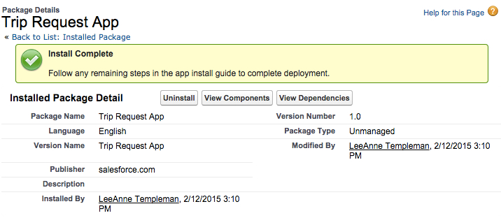
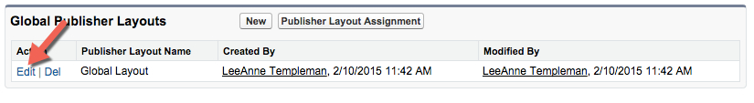
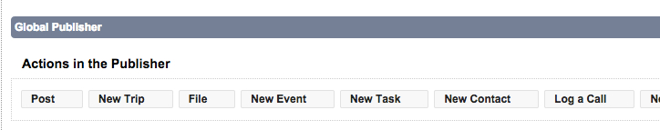
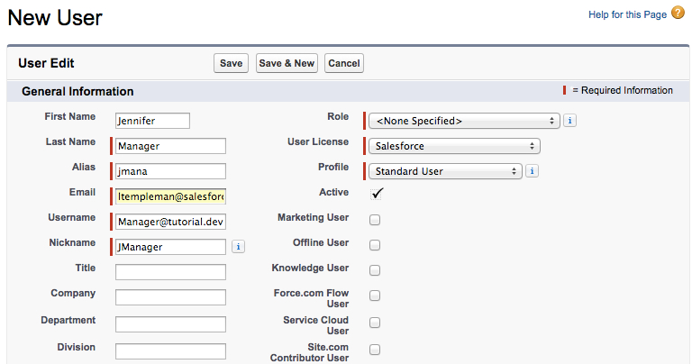
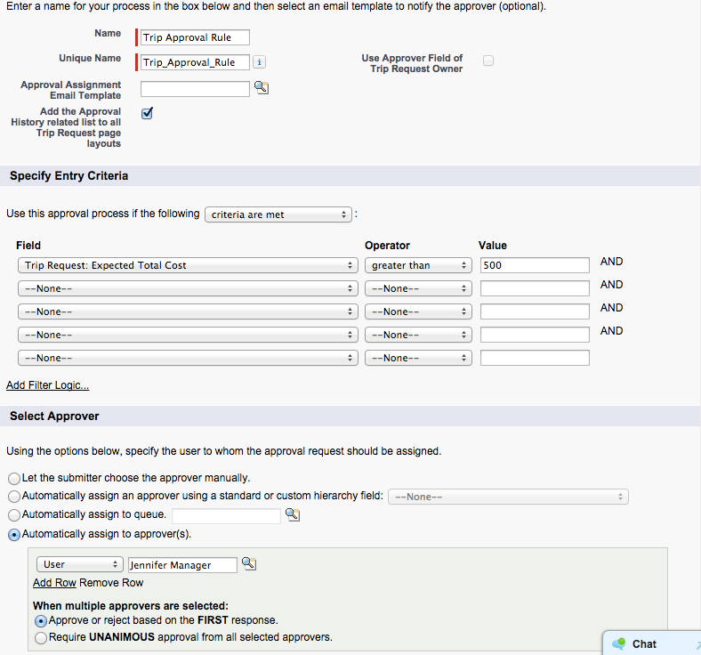

We are going to install a basic package that contains the trip request object we are building a process for. 

## What you will learn
- Install an AppExchange package
- Review package commponents
- Define package access
- Modify Global Action Layout

## Step 1: Install the AppExchange Package

The <a href="https://appexchange.salesforce.com/" target="_blank">AppExchange</a> is the world's first on-demand application-sharing service. It provides a way to browse, test drive, share, and install applications developed on Salesforce's on-demand AppExchange platform.

Partners, developers, and anyone else who chooses to participate can offer their Apps on the AppExchange directory. This directory gives Salesforce users an easy way to find and install applications to expand their use of the AppExchange platform to new areas of customer relationship management (CRM) and beyond.
The app we are installing today is a private listing, private listings have not undergone the Salesforce security review process and should be installed only from trusted providers.  More information about installing packages in Salesforce can be found <a href="https://help.salesforce.com/apex/HTViewHelpDoc?id=distribution_installing_packages.htm" target="_blank">here</a>

*Note: To install Apps from Appexchange you need to have the User Permission of “Download AppExchange Packages”.  System administrators have this permission enabled by default, but if other users would like to install packages they may need to contact the system administrator for their org.*

1. Login to your Salesforce Developer Edition

2. Copy and Paste this URL into the address bar of the browser **http://bit.ly/TripApprovalPackage** 

3. This screen will display all the components contained in this package that will be installed into your environment. Take a moment to read the types and names of elements being installed, this information can always be revisited for installed packages by navigating to **Setup|Installed Packages and viewing the details for a specific package.  
*Some package items, such as validation rules, record types, or custom settings might not appear in the Package Components list but are included in the package and installed with the other items. If there are no items in the Package Components list, the package might contain only minor changes.*

4. Select **Continue** 

5. Select **Next** on the screen for **Approve Package API Access**

6. Select **Grant access to all users** and select **Next**

For this exercise we will allow full app access to all users. In a production environment it is recommended for most packages that you install packages using the **Select Security Settings** option in order to control security settings by profile.

7. Select **Install**

8. The Install Complete screen will show.

## Step 2: Modifying the Global layout
Our process will automate business steps once a user has submitted a trip request. In order to make this process easy for our mobile users, we are going to modify the Actions available on the Salesforce1 Mobile app to include **New Trip**

1. Navigate to **Setup | Create | Global Actions | Publisher Layouts**
2. Select **Edit** next to the Global Layout

3. Drag the **New Trip** Action onto the layout field, immediately after **post** 

4. Select **Save**

## Step 3: Create User
In order to have an approval process, we will need a user to designate as the approver. 

1. **Setup | Manage User | New User**
2. Create a new User for **Jennifer Manager** 

3. Select **Save**

## Step 4: Create Approval Process 
In the Lightning Process Builder you can either use a default approval process, or specify an existing process you would like to trigger as part of a process action. Many of our users have existing approval processes in place, and for this tutorial we will show how you can tie a Process to an existing Approval Process. To do this we need to create our approval process for Trip Requests. 

1. Navigate to ** Setup | Create | Workflow & Approvals | Approval Processes ** 
1. In the drop down "Manage Approval Processes For" Select **Trip Request**
1. Select **Create New Approval Process | Use Jump Start Wizard**
1. Fill out the new approval process per the image below. 
- Name: Trip Approval Rule
- Add the Approval History related list to all Trip Request page layouts: Checked
- Expected Total Cost is greater than 500
- Automatically Assign to **Jennifer Manager** for approver

1. Select **Save**
1. Select **View Approval Process Detail Page**
1. On your approval process view select **Activate** 
1. Select **Ok**

You just installed an umanaged package into your test environmentand modified the mobile action layout! Now we can build a process using this existing package to further automate the business process. 

<a href="create-developer-edition.html" class="btn btn-default"><i class="glyphicon glyphicon-chevron-left"></i> Previous</a>
<a href="create-apex-controller.html" class="btn btn-default pull-right">Next <i class="glyphicon glyphicon-chevron-right"></i></a>

